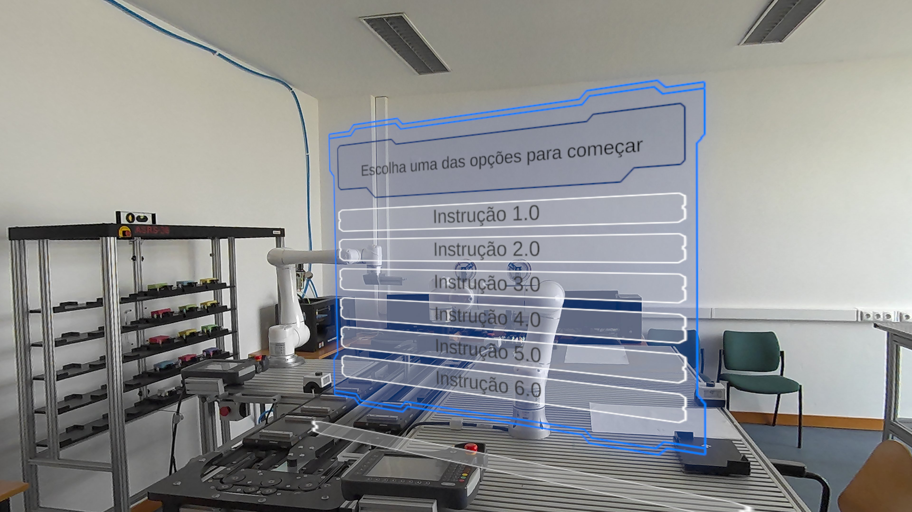
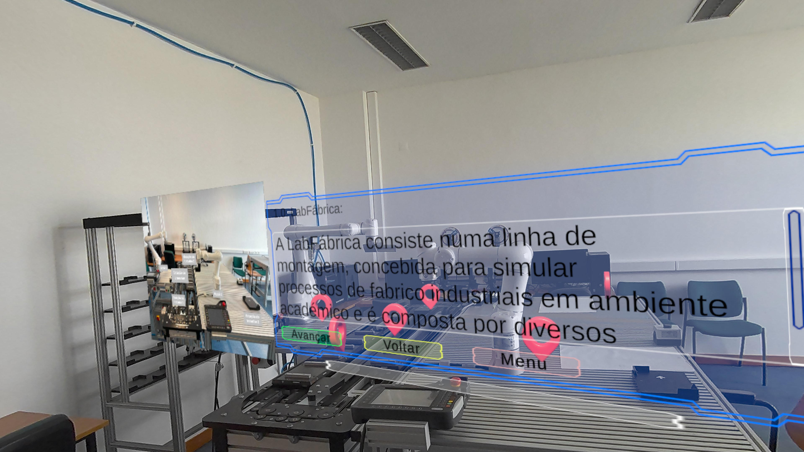
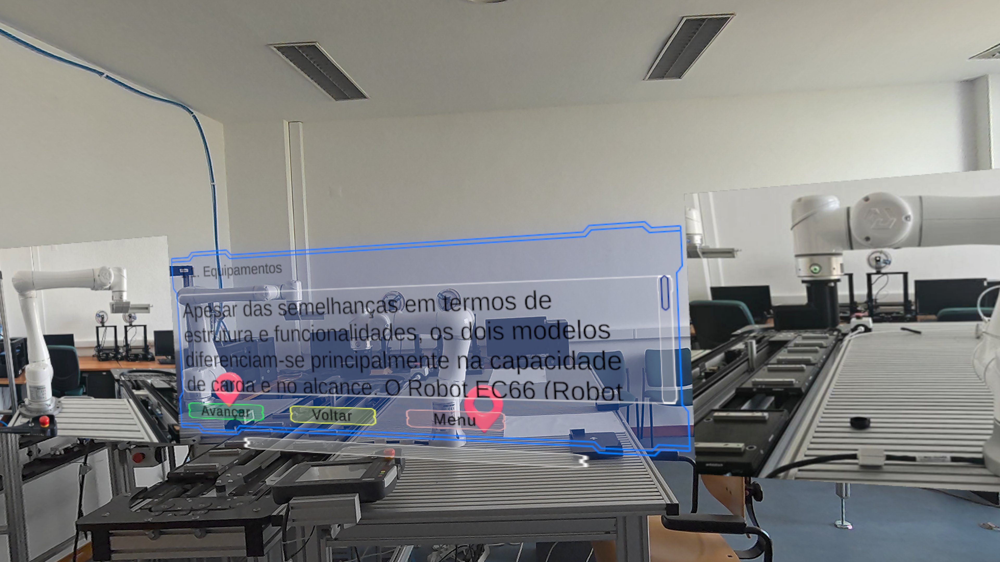

# Drivolution 1.0 — AR Interactive Instructions

**Unity · Meta Quest · XR training · industrial HCI**

> A research prototype that turns technical procedures into situated, step-by-step augmented-reality guidance for a laboratory assembly environment.

<p align="center">
  
</p>

**Video demonstrations:** [▶ Calibration flow](./assets/demos/calibration-flow.mp4) · [▶ Instruction application](./assets/demos/instruction-application-compressed.mp4)

## What this prototype demonstrates

- **Situated instruction flow:** a user selects an instructional routine and progresses through contextual steps in the physical environment.
- **World-space XR interface:** instructional panels and controls are presented alongside the training equipment instead of on a separate screen.
- **Laboratory-oriented interaction design:** the experience was designed around an assembly-line training setting, making the interface and physical context part of the workflow.
- **Standalone Meta Quest deployment:** the application was built and tested for Meta Quest hardware.

## Project context

Drivolution 1.0 explores how written technical instructions can be translated into an interactive AR experience. The prototype combines spatially placed instructional UI, guided procedure navigation, and an industrial laboratory setting to investigate immersive support for technical training.

```text
Meta Quest device
        ↓
Passthrough + world-space interface
        ↓
Unity instructional workflow
        ↓
Contextual guidance for laboratory equipment
```

## Included source code

The core C# scripts used in the prototype are available in [`src/core`](./src/core):

- **[CalibradorDeTutorial](./src/core/CalibradorDeTutorial.cs):** calibration, creation, and persistence of spatial anchors using Meta/Oculus.
- **[GerenciadorDeInstrucoes](./src/core/GerenciadorDeInstrucoes.cs):** user and task selection, instruction steps, images, pings, logs, and spatial anchor restoration.

These scripts are provided for technical reference and require the original Unity setup and project dependencies.

## Technology

- **Unity 2022.3.62f2 LTS**
- **C#** and **TextMeshPro**
- **Meta XR SDK 81.0.0**
- **Unity XR Management 4.5.3** and **Oculus XR Plugin 4.5.2**
- Android deployment for Meta Quest

## Visual walkthrough

| Instruction selection | Contextual learning content |
| --- | --- |
|  |  |

| Equipment guidance | Demo recordings |
| --- | --- |
|  | [Calibration flow](./assets/demos/calibration-flow.mp4) · [Instruction application](./assets/demos/instruction-application-compressed.mp4) |

## Public repository scope

This repository is a **public technical case study**, not a turnkey production build. It contains selected core C# scripts, non-confidential documentation, and demonstration media that show the interaction design and the prototype in use.

The original Unity project, complete source tree, scenes, binary builds, proprietary assets, industrial datasets, and project-specific materials are intentionally excluded. This keeps the public record useful while respecting confidentiality and reuse constraints.

## Related profile

For more XR, HCI, and machine-learning work, visit [Rafael Miguez on GitHub](https://github.com/rafaelmiguez).
